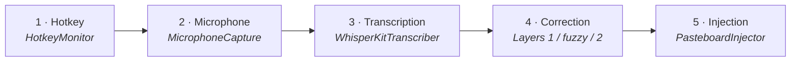
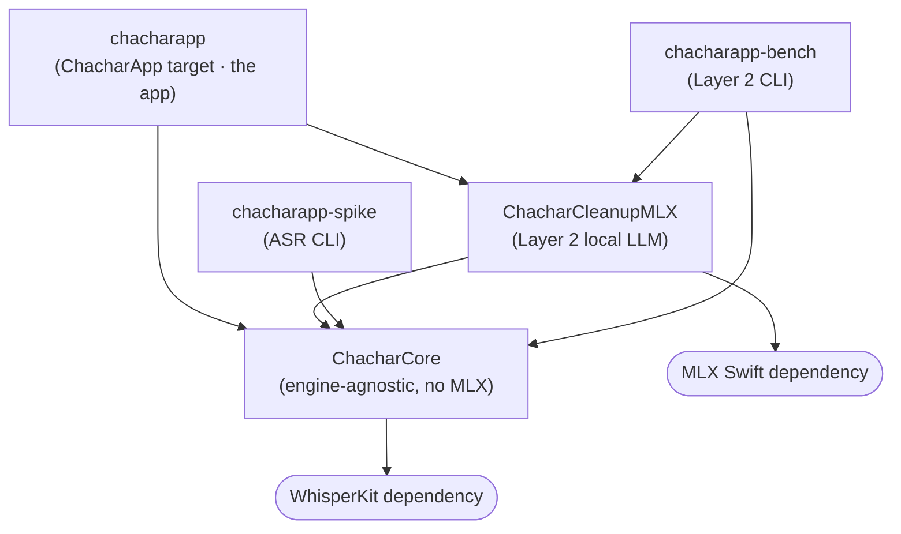
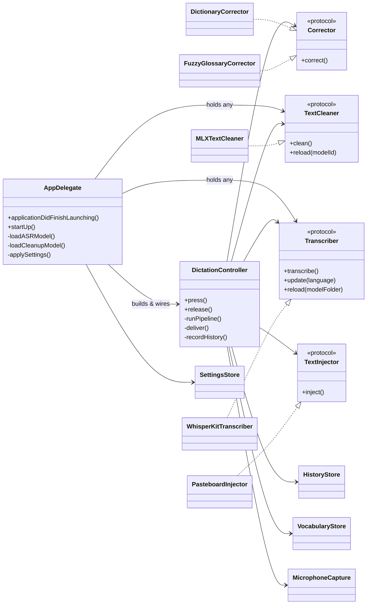
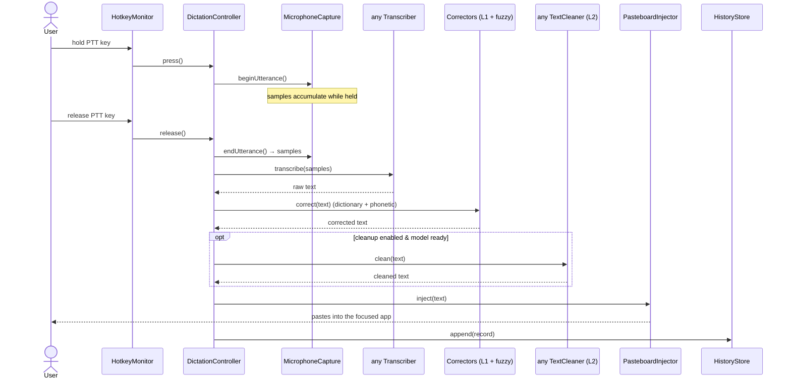
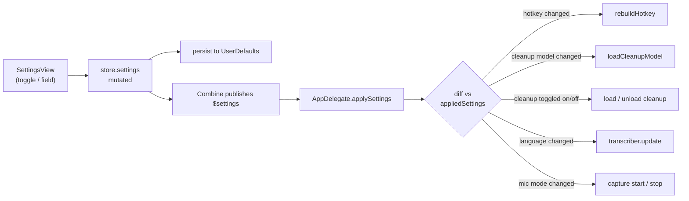
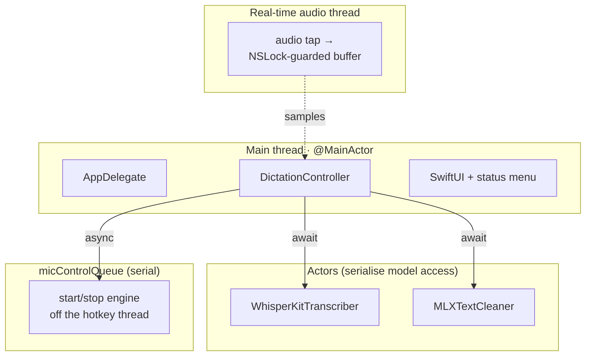

# Understanding the ChacharApp Source

> A guided, top-to-bottom reading of the codebase — meant to be read *in order*,
> like a short book. Each chapter introduces only the terms you need for that
> chapter, then builds on them. Diagrams (rendered by GitHub via Mermaid) show how the
> classes relate; the prose explains why.
>
> If you know TypeScript but not Swift, a small "Swift phrasebook" appears the first
> time each Swift-specific keyword shows up.

---

## Chapter 0 — What the app *is*, in one breath

ChacharApp is a **macOS voice-dictation tool**. You hold a key, speak, release the
key, and the words you spoke are typed into whatever app you're looking at. It runs
**entirely on your Mac** — no cloud, no account, no cost. Think "Wispr Flow, but
local and free", tuned for a Spanish speaker who mixes in English tech jargon.

Everything in the source serves that one sentence. The whole program is a loop:

```
hold key  →  record mic  →  turn audio into text  →  clean the text up  →  paste it
```

Hold that picture in your head. Every file you'll read is one station on that line,
or the machinery that keeps the stations wired together and configurable.

---

## Chapter 1 — The five stations (the mental model)

Before any code, learn the five stations by name. The rest of the guide just fills
each one in.



1. **Hotkey** — notices you pressed and released the push-to-talk key.
   *("Push-to-talk", abbreviated **PTT**, is the walkie-talkie gesture: it records
   only while the key is held.)*
2. **Microphone capture** — collects the audio while the key is down, converted to
   the exact format the recogniser wants.
3. **Transcription** — turns that audio into raw text. This is the **ASR**
   (*Automatic Speech Recognition*) step, done by a model called **Whisper**.
4. **Correction** — fixes the raw text in *layers* (Chapter 5); the key idea is that
   correction is **layered and optional**.
5. **Injection** — puts the final text into the focused app by faking a paste.

The program spends >99% of its life idle, waiting at station 1. When you press the
key, a single pass flows 1 → 2 → 3 → 4 → 5, and then it goes back to idle.

Two support systems sit beside the line:

- **Settings** — the window and menu where you choose your key, models, whether
  cleanup is on, etc. Changes apply live (Chapter 6).
- **Persistence** — three small on-disk stores: your vocabulary, your dictation
  history, and your preferences (Chapter 8).

---

## Chapter 2 — How the source is split into modules

Before the entry point, one glance at the package. `Package.swift` builds several
**targets** (compilation units). The important split is a light, testable core versus
the heavy AI dependencies:



Why this shape:

- **`ChacharCore`** holds the stations' logic (audio, ASR port, correction, injection,
  persistence). It does **not** import MLX, so it compiles fast and its unit tests run
  with plain `swift test`.
- **`ChacharCleanupMLX`** isolates the heavy local-LLM layer so the core and its tests
  never pull it in.
- **`ChacharApp`** is the UI + the glue: it depends on both.
- Two CLIs (`-spike`, `-bench`) reuse the core for measurement.

Keep this in mind: when a type is in `ChacharCore` it's meant to be reusable and
testable; when it's in `ChacharApp` it's app-specific glue.

> **Swift phrasebook — the package manifest.**
> - **SPM** (Swift Package Manager) is Swift's npm + bundler in one. `Package.swift` plays
>   the role of `package.json`, except it is *executable Swift code* that builds a
>   `Package` value.
> - A **target** is one compilation unit (a folder under `Sources/`); a **product** is
>   what consumers can use — a `.library` (importable) or an `.executable` (a binary).
>   Roughly: targets are your `src/` sub-projects, products are your published entry
>   points.
> - `Package.resolved` is the lockfile (`package-lock.json`): it pins the exact commit of
>   every dependency and is committed on purpose. The manifest constrains versions with
>   `.upToNextMinor(from: "1.0.0")` — the repo's convention forbids `.upToNextMajor`
>   (too loose for dependencies this heavy).
> - The `.testTarget` can only `import` what it declares. That is how the "no MLX in the
>   core" promise is *enforced*, not just intended: `ChacharCoreTests` depends on
>   `ChacharCore` alone, so `swift test` physically cannot pull MLX in.

---

## Chapter 3 — Where the program starts

Open `Sources/ChacharApp/main.swift`. It is nine lines:

```swift
let app = NSApplication.shared
let delegate = AppDelegate()
app.delegate = delegate
app.setActivationPolicy(.accessory) // menubar agent: no Dock icon, no main window
app.run()
```

Read it as: *create the macOS application object, hand it a "delegate" that will
receive its lifecycle events, declare that we are an **accessory** app (menu-bar only,
no Dock icon, no window), and start the event loop.*

> **Swift phrasebook.**
> - `let x = …` — a constant binding (like `const` in TS). Swift infers the type; you
>   rarely write it for locals.
> - **Delegate** — a Cocoa pattern: instead of subclassing the app, you give it an
>   object whose methods the system calls at defined moments ("did finish launching").
> - **Accessory app** — a menu-bar-only app: no main window, no Dock icon at rest.
>   Chapter 6 shows how the settings window temporarily flips this.

The single most important object is now on stage: **`AppDelegate`**. It is the
**composition root** — it creates every collaborator and wires them together.

---

## Chapter 4 — The object graph: who owns whom

This is the chapter to study if you want to know "how the classes relate". `AppDelegate`
owns the collaborators; it hands most of them to a **`DictationController`**, which runs
the actual pipeline against a set of **ports** (protocols) whose **adapters** (concrete
classes) are the real engines.



Read the diagram in three layers:

- **`AppDelegate`** (top) — composition root and app lifecycle. It creates the mic, the
  transcriber, the cleaner and the stores; it builds the `DictationController` and wires
  its callbacks; it builds the menu and the settings window; it loads/reloads models.
- **`DictationController`** (middle) — the pipeline. It doesn't *own* anything heavy;
  it holds shared references and talks only to **ports**.
- **Ports & adapters** (bottom) — `Transcriber`, `TextCleaner`, `Corrector`,
  `TextInjector` are protocols (the *ports*); `WhisperKitTranscriber`, `MLXTextCleaner`,
  `DictionaryCorrector` / `FuzzyGlossaryCorrector`, `PasteboardInjector` are the
  concrete *adapters*. `..|>` means "implements". This is **hexagonal architecture**:
  the app depends on the port so the adapter can be swapped without touching the
  pipeline.

> **Swift phrasebook.**
> - `protocol` — an interface (a *port*). `..|>` in the diagram = conforms to.
> - `any Transcriber` — an existential: "some value that conforms to `Transcriber`",
>   the Swift way to hold a port without naming the concrete adapter. `AppDelegate`
>   stores `any Transcriber`, so it literally cannot depend on WhisperKit-specific
>   methods — the seam is real.
> - `struct` vs `class` — the biggest mindset shift coming from TypeScript. A `struct` is
>   a **value type**: assigning it *copies* it (like assigning a number), so nobody can
>   mutate your copy behind your back — which is why the small data carriers
>   (`AudioSamples`, `Transcription`, `AppSettings`, `Vocabulary`) are structs. A `class`
>   is a **reference type** (like every TS object): assigning shares the one instance.
>   The stations that hold live resources — the mic, the loaded model, open files — are
>   classes or actors *because* everyone must talk to the same instance.
> - `let capture = MicrophoneCapture()` — `let` freezes the *reference*, not the object:
>   you can still call state-changing methods on a `let` class instance (same as `const`
>   in TS). On a `struct`, `let` really does freeze the entire value.
> - `Sendable` — a compiler-checked marker meaning "safe to hand across threads". Every
>   port protocol here requires it; Chapter 9 explains why it isn't optional in this app.

---

## Chapter 5 — Boot: what happens the moment the app launches

At the top of `AppDelegate` is the cast of characters (the stored properties from
Chapter 4). When macOS finishes launching, it calls `applicationDidFinishLaunching`,
which does three quick things and then starts the real work asynchronously:

```swift
appliedSettings = settingsStore.settings          // remember current settings for diffing
setupStatusItem()                                  // draw the menu-bar icon + menu
settingsCancellable = settingsStore.$settings
    .dropFirst()
    .sink { [weak self] settings in self?.applySettings(settings) }  // react to live changes
Task { await startUp() }                           // the heavy lifting, off the main path
```

> **Swift phrasebook.**
> - `Task { await … }` — start asynchronous work; `await` suspends until a result is
>   ready without blocking the thread (like TS).
> - `settingsStore.$settings … .sink { … }` — **Combine** (Apple's reactive framework):
>   `$settings` is a *publisher* that emits on every settings change; `.sink`
>   subscribes. This is what makes settings apply **live** (Chapter 6).
> - `[weak self]` — the one with no TS equivalent. Swift has **no garbage collector**; it
>   uses **ARC** (automatic reference counting): an object dies the instant its last
>   strong reference does. A closure captures `self` *strongly* by default, so "object
>   holds subscription → subscription's closure holds object" would be a cycle neither
>   side can ever break — a leak. `[weak self]` makes the capture non-owning (`self`
>   becomes optional inside, hence the `self?.…` spelling), breaking the cycle.
> - `AnyCancellable` (the type of `settingsCancellable`) — the subscription handle.
>   Combine cancels the subscription when this value is deallocated, which is why it is
>   *stored in a property*: as a local it would die at the end of the method, silently
>   killing the live-settings behaviour with it.
> - `private lazy var dictation = makeDictationController()` — `lazy` defers creation to
>   first use. Needed here because the controller's callbacks capture `self`, which isn't
>   available until `init` has completed.
> - `.dropFirst()` — `$settings` replays its current value to every new subscriber;
>   dropping that first emission means "react to *changes* only", so boot doesn't
>   re-apply the state it just finished applying.

`startUp()` is the boot sequence, numbered 1–4 in the code:

1. **Touch the microphone** once, to trigger the "allow microphone?" prompt on first
   run; then keep it warm or close it per your setting.
2. **Load the speech model** (`loadASRModel`). On failure it falls back to the bundled
   model so dictation always works.
3. **Start the global hotkey** (`HotkeyMonitor.start()`) — needs **Accessibility**
   permission; if missing, it asks.
4. **Load the cleanup model** (Layer 2) — but **only if cleanup is enabled**; then
   *pre-warm* it with a throwaway generation so the first real press pays no load delay.
   Turning cleanup off later frees the model; it is no longer held resident while the
   toggle is off.

After `startUp()` the app sits idle at station 1, waiting for a key press.

---

## Chapter 6 — The heartbeat: one press, one dictation

This is the chapter to understand deeply. Since the last refactor, the pipeline lives in
its own class, **`DictationController`** (`Sources/ChacharApp/DictationController.swift`).
`AppDelegate` just forwards key events to it and supplies callbacks:

- key down → `dictation.press()`
- key up → `dictation.release()`

Here is exactly what flows through the stations on one press:



In code, `release()` stays at one level of abstraction (stop capturing, prepare the
correctors, hand off), and the async chain lives in `runPipeline(...)`:

```swift
func release() {
    let samples = capture.endUtterance()
    // … close the mic again if in "only while dictating" mode …
    let vocab = vocabulary.reloadIfChanged()                 // pick up hand-edits
    if let parseError = vocabulary.lastParseError { onWarning(parseError) }
    let corrector = DictionaryCorrector(vocab.replacements)  // Layer 1
    let runCleanup = settings.settings.cleanupEnabled && isCleanupReady()
    Task { await runPipeline(samples: samples, vocab: vocab, corrector: corrector, runCleanup: runCleanup) }
}
```

Three things about `release()` reward a slow read:

- **It snapshots everything the async work will need — before launching the `Task`.** The
  vocabulary, the corrector built from it, and the "should Layer 2 run?" decision are all
  captured as plain values *now*. If the user flips a toggle or edits the vocabulary
  while the pipeline is mid-flight, this dictation finishes under the rules it started
  with; the *next* press sees the new state. Passing immutable values into async work
  instead of sharing mutable state is the cheapest concurrency-correctness trick in the
  book, and this method is its poster child.
- **`Task { … }` is unstructured concurrency** — closer to calling a `void`-returning
  async function in TS without awaiting it than to an awaited promise. Nothing waits for
  the pipeline: the hotkey callback must return immediately (Chapter 9 explains why), and
  results flow back through the `onStatus` / `onDelivered` / `onWarning` closures.
- **Every failure has a decided fallback.** Trace the error posture through
  `runPipeline`: transcription failure → status line + warning, never a crash; Layer 2
  failure (`try?`) → silently keep the Layer 1 text; empty result → "(no speech
  detected)". Dictation is a muscle-memory gesture — the pipeline treats "always deliver
  something sensible" as part of its contract, not as an afterthought.

> **Swift phrasebook — errors.**
> - Functions that can fail are marked `throws`, and callers *must* write `try` — failure
>   is visible at every call site, unlike a TS function whose `throw` is invisible in its
>   type.
> - `do { try … } catch { … }` — the try/catch equivalent; inside `catch`, `error` is
>   implicitly in scope.
> - `try? expr` — "on failure, give me `nil` instead of an error". The pipeline uses it
>   exactly where a failure should mean *skip this step*, not *abort the dictation*
>   (Layer 2 cleanup is the clearest case).
> - `try!` — crash on failure. The repo avoids it; its one force-unwrap
>   (`AVAudioFormat(...)!` in the mic) is a deliberate fail-fast on a format that cannot
>   be invalid, documented at the site.

`runPipeline` reads like the sequence diagram: **trim the silent tail** → transcribe →
Layer 1 → fuzzy Layer 1 → **strip a trailing hallucination** → optional Layer 2 →
`deliver` → `recordHistory`. Read those two methods and you have read the entire product.

> **Why the split?** `AppDelegate` used to hold all of this inline (it was a 400-line
> "God object"). Extracting `DictationController` gives the pipeline one clear job and
> makes it independently testable. The controller reports back through closures
> (`onStatus`, `onDelivered`, `onWarning`) instead of reaching into the UI — so it
> stays UI-agnostic.

> **One hard-won detail** (worth reading in the code comments): opening the audio engine
> is slow, so `press()` starts it on a background queue (`micControlQueue`), never on the
> keyboard-event thread — a blocking start there once stalled the tap and dropped the
> key *release*, leaving the app stuck recording.

---

## Chapter 7 — The stations, one file at a time

Now zoom into each station. Stations 2–5 live in `Sources/ChacharCore/`.

### Station 1 — `HotkeyMonitor` (`ChacharApp/HotkeyMonitor.swift`)

Watches the keyboard globally using a **CGEventTap** — a low-level macOS hook that sees
key events system-wide (this is *why* the app needs Accessibility permission). The
concept to grasp is **`PushToTalkTrigger`**, a small enum:

- `.key(code)` — a normal key like F7. Detected on key-down/up and **swallowed** so it
  doesn't also do its normal job.
- `.modifier(code)` — a modifier like Right ⌘. Detected via "flags changed" and **passed
  through** (swallowing a modifier would corrupt keyboard state).

Key codes are named in the `KeyCode` type (`ChacharCore/KeyCode.swift`), so triggers read
as `.key(KeyCode.f7)` rather than `.key(98)`. Supporting several triggers at once lets
the same gesture work on the built-in keyboard (F7) *and* an external keyboard whose
function row is hijacked (Right ⌘). It also supports a **toggle** ("hands-free") mode.

Two implementation details are worth reading slowly, because they are the least
TypeScript-like code in the repo:

1. **Getting `self` into a C callback.** A `CGEventTap` calls back through a *C function
   pointer*, and C knows nothing about closures — the callback cannot capture `self`. The
   standard dance: when creating the tap, pass `self` disguised as a raw pointer
   (`Unmanaged.passUnretained(self).toOpaque()`, handed over as the `userInfo`/"refcon"
   argument), and inside the callback turn the pointer back into the object
   (`Unmanaged<HotkeyMonitor>.fromOpaque(refcon).takeUnretainedValue()`). *Unretained*
   means ARC's reference count is not touched in either direction — the deal is simply
   that the monitor must outlive the tap, which `stop()` guarantees by tearing the tap
   down (disable + invalidate the port) before the monitor is released.
2. **Modifiers don't have key-up events.** A normal key (F7) produces `keyDown`/`keyUp`
   pairs, and the monitor *swallows* both (returns `nil` from the callback) so the key
   doesn't also perform its usual action. A modifier (Right ⌘) instead produces a single
   `flagsChanged` event on *each transition*, so the monitor tracks down-state itself in
   `modifiersDown`: first event for a keycode = press, next = release. Modifier events
   are always *passed through* — swallowing one would leave the rest of the system
   convinced ⌘ is still (or never was) held, corrupting every subsequent click and
   shortcut.

Also note `activeTrigger`: only the trigger that *started* a session may end it. That one
field guarantees a matched press/release pair even if you hold F7 and tap Right ⌘
mid-dictation, and it doubles as the auto-repeat filter (a second press while active is
ignored).

### Station 2 — `MicrophoneCapture` (`ChacharCore/Audio/MicrophoneCapture.swift`)

Records via `AVAudioEngine` and converts every chunk to **16 kHz mono float** — the
format Whisper expects (the rate is the shared constant `AudioSamples.whisperSampleRate`).
Two ideas matter: **warm vs. cold** (keeping the engine running removes the first-press
cost, at the price of the "mic in use" indicator staying on — the `micOnlyWhileDictating`
setting picks the trade-off), and **the real-time thread** (audio arrives on a
high-priority thread that must never block, so state here is guarded by locks, not an
actor — see Chapter 9). There are two locks with distinct jobs: `bufferLock` guards the
sample buffer the real-time thread appends to, and `stateLock` guards the engine
lifecycle (`start`/`stop` are called from both the main thread and the mic queue, and
`AVAudioEngine` is not thread-safe). The state lock is never taken on the real-time
thread, so audio delivery can't stall behind an engine transition.

A third idea joined later: **the input device can change under you**. `AVAudioEngine`
caches its input device's format, and that cache goes stale when the default input
switches (AirPods connecting, for instance) — installing a tap with a stale format raises
an Objective-C exception Swift cannot catch, which aborts the process. So `start()`
always builds a *fresh* engine (re-querying the hardware, a few ms), and an
`AVAudioEngineConfigurationChange` observer rebuilds and restarts a running engine when
the device or its format changes mid-flight (Bluetooth mics renegotiate their format the
moment capture begins, stopping the engine silently).

How the audio actually flows: `start()` installs a **tap** on the engine's input node — a
callback that receives every ~4096-frame buffer the microphone produces, in the
hardware's native format (typically 48 kHz stereo). Each buffer is pushed through an
`AVAudioConverter` down to 16 kHz mono on the spot, then appended to `collected` — but
only while `isCollecting` is true. That flag is the whole "warm mic" economics: when
you're not dictating, buffers still arrive, fail the flag check, and are dropped, so
keeping the engine open costs almost nothing.

One curiosity for the road: the converter pulls its input through a callback, and Swift 6
requires that callback to be `@Sendable` — it may not capture a mutable local variable.
The tiny `ConverterInput` box class exists purely to smuggle "this one buffer, not yet
consumed" across that boundary. It looks over-engineered until you try to delete it and
the compiler explains, at length, why you can't.

### Station 3 — Transcription (`ChacharCore/ASR/`)

- **`Transcriber.swift`** — the *port*: protocol `Transcriber` (`transcribe`, `update`,
  `reload`) plus the value types `AudioSamples` and `Transcription`.
- **`WhisperKitTranscriber.swift`** — the *adapter*: backed by **WhisperKit** (on-device
  Whisper on Apple's Neural Engine via CoreML). It's an **actor** (Chapter 9) that keeps
  the model warm for the app's whole life. `prepare()` and `reload()` share one private
  `load(modelFolder:)` so both pay the same warm-up once.
- **`ASRModelManager.swift`** — locates, validates and downloads model folders. A valid
  WhisperKit folder must contain three CoreML sub-models (`MelSpectrogram`,
  `AudioEncoder`, `TextDecoder`); this file checks that.

> **Swift phrasebook — `actor`.**
> - An `actor` is a class whose state is protected by a built-in serial "mailbox": every
>   call from outside is `await`ed and runs one at a time. It is the async/await-native
>   alternative to wrapping every method body in a lock.
> - The practical consequence here: if a dictation is mid-transcription and you switch
>   models in Settings, the `reload` simply *queues* behind the in-flight `transcribe` —
>   no torn state, and no locking code to review.
> - `await` marks a **suspension point**: the calling task pauses (its thread is freed for
>   other work) until the actor delivers a result — like awaiting a promise, except the
>   compiler also uses these points to prove the program free of data races.

Why the warm-up matters: the first time a CoreML model runs on a given chip, macOS
**specializes** it — compiles it for that exact Neural Engine — a one-time cost that can
reach tens of seconds on the first-ever load, and is cached by the OS afterwards (real
numbers in [`latency.md`](latency.md)). `load(modelFolder:)` therefore ends by
transcribing one second of silence and throwing the result away: it forces the
specialization *and* the first-inference setup to happen at load time, so the user's
first real dictation is as fast as every other one.

### Station 4 — Correction (`ChacharCore/Correction/`) — *the layers*

Correction is organised as **layers**, cheapest and most local first:

- **Layer 0 — glossary prompt bias.** *Currently disabled by design* — on the bundled
  turbo model, feeding a glossary prompt collapses the decoder to an empty
  transcription (see `docs/layer0-glossary-findings.md`). The code is kept but the app
  calls `transcribe(…, prompt: nil)`.
- **Layer 1 — deterministic dictionary** (`Corrector.swift` → `DictionaryCorrector`).
  Exact regex find/replace from your `vocabulary.json`. Instant, local, predictable.
- **Layer 1 (fuzzy) — phonetic matching** (`FuzzyGlossaryCorrector.swift`). Catches
  *misheard* jargon without pre-writing the misspelling: it reduces words to a Spanish
  **phonetic key** (`PhoneticFold`: `GicoCam` and `hikokam` both fold to `xikokam`) and
  swaps a near-match for the canonical term. Read `PhoneticFold` first, then `correct`.
- **Layer 1 (safety net) — trailing-hallucination filter** (`HallucinationFilter.swift`).
  Whisper, trained partly on YouTube captions, hallucinates a stock phrase — a stray
  *gracias* / *thank you* / subtitle credit — on near-silent tails. This strips such a
  phrase **only when it is the isolated final clause**, so a genuine "muchas gracias por tu
  ayuda" is left untouched. Its root-cause partner is `Audio/SilenceTrim.swift`, which cuts
  the dead air *before* transcription (also a small latency win); this filter catches what
  still slips through. Both are gated by the `trailingHallucinationFilter` setting (on by
  default).
- **Layer 2 — LLM cleanup** (`TextCleaner.swift` port → `MLXTextCleaner` adapter in
  `ChacharCleanupMLX`). A small local model removes fillers and resolves spoken
  self-corrections ("en Postgres, no, en Redis" → "en Redis"). **Optional, off by
  default**, because it costs seconds. Its *delete-only* prompt is the heart of getting
  an LLM to behave here — and it does **not** touch jargon; that stays a Layer 1 job.

Mental rule: **Layer 1 (dictionary + fuzzy + hallucination filter) is always on and
instant; the cleanup toggle gates *only* Layer 2, which is opt-in and slow; Layer 0 is
parked.** So jargon like *GicoCam* or *ChacharApp* is corrected even with cleanup off —
that is Layer 1, independent of the toggle.

#### Worked example — how "cubernetes" becomes "Kubernetes"

Say the glossary contains `Kubernetes` and Whisper heard *"despliega en cubernetes"*.

1. At construction, the corrector folds every glossary term to a **phonetic key**:
   `Kubernetes` → lowercase → fold letter by letter → **`kubernetes`**.
2. Scanning the text, it takes windows of 1–3 consecutive words. The window `cubernetes`
   folds to **`kubernetes`** too — hard `c` and `k` collapse to the same class (`k`),
   which is the whole point: the key encodes *how a Spanish speaker pronounces the word*,
   not how it happens to be spelt.
3. A candidate is accepted when three guards pass: the **Levenshtein distance between the
   keys** is within 25% of the term key's length (here distance 0 ≤ 2); the key is at
   least 4 characters long (shorter keys collide with ordinary words); and the window
   isn't *already* exactly a glossary term — a correct `Kubernetes` in the text is
   locked, so a longer window can't swallow it together with its neighbour.
4. The window is replaced by the canonical spelling: *"despliega en Kubernetes"*.

Multi-word mishearings work because windows are joined before folding: *"hiko cam"* →
`xikokam`, which matches the glossary term *GicoCam* → `xikokam`. And the reason `g`,
`j`, `h` and `x` all fold to the same letter is precisely that class of error: to a
Spanish ear they are one sound (the jota), so the key treats them as one.

The hallucination filter deserves its own example. *"Muchas gracias por tu ayuda."*
survives untouched — "gracias" is not the isolated final clause. *"Súbelo a producción.
Gracias."* loses its trailing *"Gracias."*, but only because that clause stands alone
after the last sentence terminator **and** appears on the short, curated phrase list. The
filter is deliberately biased: it would rather let a real hallucination through than
delete real speech — the silence trim upstream exists so it rarely has to decide at all.

#### Inside the Layer 2 cleaner (`MLXTextCleaner`)

The cleaner is the one place in the codebase where *prompt engineering* is load-bearing,
so it deserves its own zoom. The core problem: a general instruct LLM asked to "clean up"
text will happily *rewrite* it — translating jargon, swapping verbs, "improving" the
phrasing. For dictation that is catastrophic: the user said what they said. The defence
is layered:

- **A delete-only contract.** The instructions forbid substituting, translating,
  reordering or adding words; the model may only *remove* — fillers ("eh", "o sea"),
  immediate repetitions, and the discarded branch of a spoken self-correction
  ("en Postgres, no, en Redis" → the abandoned half and its cue word are deleted, nothing
  else changes).
- **Few-shot examples** teach the behaviour better than rules alone — and they are
  deliberately different from the benchmark phrases, so if the model ever parrots an
  example the leakage is visible instead of silently inflating benchmark scores.
- **A generation cap sized from the input.** Delete-only output can never be longer than
  its input, so `maxTokens` is derived from the input's length (a generous ~3
  characters-per-token estimate) rather than fixed: long dictations are never truncated,
  yet a runaway generation is still bounded.
- **`postProcess` as the last line of defence.** Models drift in known ways: they prepend
  labels ("Salida:"), keep generating extra "Entrada/Salida" pairs (a classic few-shot
  failure mode), or wrap the answer in quotes. Each is stripped mechanically — and if
  after all stripping nothing is left, the cleaner returns the *input*. "On any doubt,
  fall back to what the user said" is enforced in code, not just stated in the prompt.
- **Temperature 0** makes all of it deterministic: same input, same output, benchmarkable
  (`chacharapp-bench` exists exactly to measure this).

Around the prompt sit three lifecycle niceties: a **metallib guard** (`prepare` refuses
to load if MLX's compiled Metal library isn't in the bundle, because MLX would otherwise
abort the whole process, uncatchably); a **`warmUp()`** throwaway generation so the first
real cleanup doesn't pay Metal pipeline compilation (~1 s on the 7B); and **`unload()`**,
so the ~4–5 GB model is resident only while the cleanup toggle is actually on.

### Station 5 — Injection (`ChacharCore/Injection/TextInjector.swift`)

The `TextInjector` port has one method, `inject(_:)`. `PasteboardInjector` does the
universal trick: **save the clipboard → put our text on it → synthesize ⌘V → restore the
old clipboard** a moment later. Riding the normal paste path makes it work in native,
Electron and web apps alike.

Two guard-rails around the trick: the dictated text is marked with
`org.nspasteboard.ConcealedType` (the nspasteboard.org convention), so clipboard managers
like Alfred or Maccy don't record everything you dictate into their history; and the
restore first checks the pasteboard's `changeCount` — if anything else wrote to the
clipboard during that brief window, that write wins instead of being clobbered by the
restore.

---

## Chapter 8 — The Settings subsystem

Settings live in `Sources/ChacharApp/Settings/`. The key insight is a clean split
between three kinds of state:

- **`AppSettings`** — the user's *choices* (`Codable`, one JSON blob). Its hand-written
  `init(from:)` decodes each field defensively, so adding a setting in a future version
  doesn't wipe a user's existing settings.
- **`SettingsStore`** — the *single source of truth*: holds `AppSettings`, saves every
  change to `UserDefaults`, and **publishes** changes via Combine.
- **`RuntimeStatus`** — *live status that is not a user choice* ("model still loading?",
  "download 40%"), kept deliberately separate.

> **Swift phrasebook — property wrappers (the `@` things).**
> - A property wrapper is a type that intercepts a property's storage — think a decorator
>   that owns the backing field.
> - `@Published var settings` (inside an `ObservableObject`) — every assignment also
>   emits the new value to subscribers; the `$settings` spelling is the *publisher* view
>   of the same property (Combine's observable stream).
> - `@ObservedObject var store` (inside a view) — "re-render this SwiftUI view whenever
>   the object's `@Published` properties change". SwiftUI views are cheap value structs
>   that get re-created constantly; the observed objects are the durable state they
>   render.
> - `@State private var selection` — view-local state that survives those re-creations
>   (the `useState` of SwiftUI).
> - `didSet { persist() }` — a property observer: run code after every assignment. It is
>   how `SettingsStore` guarantees *no settings change can forget to be saved* —
>   persistence is attached to the storage itself, not sprinkled across call sites.
> - `UserDefaults` — the platform key-value store, macOS's `localStorage`.

The defensive `init(from:)` in `AppSettings` deserves one concrete scenario, because the
failure it prevents only shows up after an update ships. `Codable` (Swift's built-in
serialization — `JSON.parse` with a schema, roughly) synthesizes *strict* decoding: every
non-optional field must be present or the whole decode throws. Now picture version 2
adding one field to `AppSettings`. Every v1 user's stored blob lacks that key →
synthesized decoding throws → the fallback returns a fresh `AppSettings()` → **every
setting silently resets on upgrade**. The hand-written init decodes field by field with
`decodeIfPresent … ?? defaults.…`, so old blobs keep everything they have and new fields
quietly take their default. One subtlety inside: `asrLanguage` is *itself* optional
(`nil` means auto-detect), so the code distinguishes "key absent → use the default" from
"key present with value `null` → the user chose auto-detect".

Around those sit `ASRModelController` (Models-tab logic), `ModelCatalog` (the model spec
table, entries of type `ModelDescriptor`), the two view-models (`HistoryViewModel`,
`VocabularyViewModel`), the SwiftUI `SettingsView`, and `SettingsWindowController` (which
flips the app from *accessory* to *regular* while the window is open, so ⌘C/⌘V work).

The same state split powers the **first-run setup guide** in
`Sources/ChacharApp/Onboarding/`: `OnboardingController` owns the window and polls the
two TCC grants (they have no change-notification API) once per second while it's visible,
publishing them as `@Published` state; `OnboardingView` renders a live checklist —
Microphone, Accessibility, and the one-time speech-model download (observed through
`RuntimeStatus`, which the model download reports progress into). `AppDelegate` opens the
guide on launch whenever setup is incomplete (first run, a revoked permission, a deleted
model); the status menu's "Setup Guide…" reopens it on demand.

How a live change flows:



The **diff** matters: the publisher fires on *every keystroke* in the UI, so
`applySettings` compares against the last-applied snapshot and runs only the effect that
actually changed.

---

## Chapter 9 — How the code stays thread-safe (concurrency)

ChacharApp touches three tricky execution contexts: the **main thread** (UI + the event
tap), the **real-time audio thread**, and background **`Task`s** for model work. Swift
6's strict concurrency forces this to be explicit.



The four patterns and when each is used:

- **`@MainActor`** on a type (`AppDelegate`, `DictationController`, `SettingsStore`, the
  view-models) — "runs on the main thread." UI-touching code lives here.
- **`actor`** (`WhisperKitTranscriber`, `MLXTextCleaner`) — serialises its own access;
  you `await` to talk to it. Protects the loaded models from concurrent use.
- **`@unchecked Sendable` + an `NSLock`** (`MicrophoneCapture`, `VocabularyStore`,
  `HistoryStore`) — "safe to share; I guard shared state with a manual lock." Used where
  an actor *can't* be: the real-time audio callback can't `await`.
- **A dedicated `DispatchQueue`** (`micControlQueue`, inside `DictationController`) —
  moves slow mic start/stop off the keyboard-event thread.

One-line summary: **actors for the models, locks for the real-time audio, main actor for
UI, and a side queue to keep the hotkey thread responsive.**

Why all the ceremony exists — three definitions that make the chapter click:

- A **data race** is two threads touching the same memory at the same time, at least one
  of them writing. Coming from TypeScript this failure mode simply doesn't exist (one
  thread per isolate); in Swift it is the default failure mode of shared state, and
  Swift 6's *strict concurrency* turns it into a compile-time error instead of a 3 a.m.
  crash.
- **`Sendable`** is the compiler's proof obligation: a type may cross a thread/actor
  boundary only if sharing it is provably safe — value types of Sendable fields, actors,
  or immutable classes. Every port protocol here is `Sendable` so adapters can be handed
  into background tasks.
- **`@unchecked Sendable`** is the escape hatch: "compiler, trust me — I guard this state
  manually." It is a *promise, not a proof*, which is why `MicrophoneCapture`,
  `VocabularyStore` and `HistoryStore` document their locking discipline right next to
  the declaration: once the compiler stops checking, the comment *is* the spec. (The
  mic's original lifecycle race — `start()`/`stop()` mutating engine state from two
  threads with no lock — lived precisely in this blind spot until an audit caught it.
  `@unchecked` code is reviewed by humans or by no one.)

One more idiom appears where the hotkey meets the pipeline:
`MainActor.assumeIsolated { self.dictation.press() }`. The event-tap callback *does* run
on the main thread (the tap was added to the main run loop), but it arrives through a C
function pointer, so the compiler can't see that. `assumeIsolated` asserts the fact at
runtime — the honest version of "I know where I am" — and crashes loudly if the
assumption is ever wrong, instead of quietly corrupting main-actor state.

---

## Chapter 10 — Where your data lives

Three small stores, all under `~/Library/Application Support/ChacharApp/` (nothing
leaves the machine):

- **`vocabulary.json`** (`VocabularyStore`) — glossary + replacement rules. Editable in
  the app *and* by hand; the store reloads on change (`reloadIfChanged`). A malformed
  hand-edit is not silently ignored: it's recorded in `lastParseError`, the previous
  vocabulary is kept, and the pipeline reports a warning.
- **`history.jsonl`** (`HistoryStore`) — one dictation per line (**JSON Lines**),
  append-only in the hot path. The format choice *is* the reliability story: appending a
  record touches only the end of the file (a single JSON array would mean rewriting the
  whole file on every dictation), a crash mid-write corrupts at most the last line, and
  the reader skips malformed lines instead of failing — so one bad write can never poison
  the log. It stores both the *raw* recognition and the *final inserted* text, so a lost
  paste can be recovered. Editing (per-row delete, retention trim) is the rare path and
  rewrites the file under a single lock hold.
- **`UserDefaults`** (`SettingsStore`) — the preferences blob.

Downloaded ASR models live in `…/ChacharApp/Models/`; the bundled turbo **ASR** model ships
inside the `.app`. The **cleanup (Layer 2) model is *not* bundled** — MLX downloads it from
Hugging Face **by id, on first use** (e.g. `mlx-community/Qwen2.5-7B-Instruct-4bit`) into the
shared Hugging Face cache, so a fresh install ships no LLM and dictation works without one.
(Importing a *local* cleanup folder, the way ASR supports it, is not implemented yet.)

---

## Chapter 11 — The other executables

- **`chacharapp`** — the real menu-bar app (this guide).
- **`chacharapp-spike`** (`Sources/ChacharSpike`) — a CLI that transcribes an audio file
  and prints timings; the simplest possible use of `WhisperKitTranscriber`, a good
  on-ramp.
- **`chacharapp-bench`** (`Sources/ChacharBench`) — benchmarks the Layer-2 LLM cleanup;
  it links MLX, so it's built with Xcode (see `CLAUDE.md`).

---

## Chapter 12 — "I want to change X — where do I go?"

| I want to… | Start in… |
|------------|-----------|
| Add/rename a push-to-talk key | `KeyCode.swift` + `AppSettings.swift` (`PTTOption.catalog`) + `HotkeyMonitor.swift` |
| Change what happens on press/release | `DictationController.press` / `release` / `runPipeline` |
| Add a correction rule type | `Correction/` (new `Corrector`), wire it in `DictationController.runPipeline` |
| Tune the fuzzy matcher | `FuzzyGlossaryCorrector.swift` (its init parameters) |
| Change the cleanup prompt/behaviour | `MLXTextCleaner.swift` (`instructions` / `fewShot`) |
| Tune the trailing-"gracias" filter | `HallucinationFilter.swift` (phrase set) / `Audio/SilenceTrim.swift` |
| Swap the ASR or cleanup engine | implement `Transcriber` / `TextCleaner`, construct it in `AppDelegate` |
| Add a settings option | `AppSettings.swift` → `SettingsView.swift` → handle in `AppDelegate.applySettings` |
| Change a default model / the sample rate | `ChacharCore/Defaults.swift` / `AudioSamples.whisperSampleRate` |
| Support a new/downloadable model | `ModelCatalog.swift` + `ASRModelController.swift` |
| Change how text is inserted | `TextInjector.swift` (`PasteboardInjector`) |
| Tune the clipboard save/restore | `TextInjector.swift` (`restoreDelay`, the concealed-type marker, the `changeCount` guard) |
| Adjust startup order | `AppDelegate.startUp()` |

---

## Chapter 13 — Build & run

- **Everyday build/test of the core** (no MLX, no Xcode needed): `swift build` ·
  `swift test`.
- **Build & install the real app**: `./Scripts/install.sh` — it uses **xcodebuild**
  (not `swift build`), because MLX's Metal library is only compiled by Xcode's build
  system, and the app must be signed with a stable certificate so macOS keeps your
  Microphone/Accessibility grants across rebuilds.
- **Try the ASR alone**: `swift run chacharapp-spike <audioFile>`.

The two permissions the app needs — and why — are **Microphone** (station 2) and
**Accessibility** (stations 1 and 5: the global key tap and the synthetic ⌘V).

---

## Appendix — File map at a glance

```
Sources/
├── ChacharApp/                     the menu-bar app (UI + composition root)
│   ├── main.swift                  ← entry point (Ch. 3)
│   ├── AppDelegate.swift           ← composition root + lifecycle (Ch. 4–5)
│   ├── DictationController.swift   ← the press→inject pipeline (Ch. 6)
│   ├── HotkeyMonitor.swift         station 1 — PTT key (Ch. 7)
│   ├── HUDController.swift         optional on-screen HUD (currently unused)
│   ├── Onboarding/                 first-run setup guide (Ch. 8)
│   │   ├── OnboardingController.swift  owns the window; polls the TCC grants
│   │   └── OnboardingView.swift        SwiftUI checklist (permissions + model download)
│   └── Settings/                   the Settings subsystem (Ch. 8)
│       ├── AppSettings.swift       user choices (Codable)
│       ├── SettingsStore.swift     source of truth + persistence + Combine
│       ├── RuntimeStatus.swift     live, non-persisted status
│       ├── ASRModelController.swift Models-tab logic
│       ├── ModelCatalog.swift      known-models table (ModelDescriptor)
│       ├── HistoryViewModel.swift  history viewer VM
│       ├── VocabularyViewModel.swift vocabulary editor VM
│       ├── SettingsView.swift      SwiftUI window
│       └── SettingsWindowController.swift owns the window (accessory↔regular)
│
├── ChacharCore/                    engine-agnostic core (no MLX; unit-tested)
│   ├── KeyCode.swift               named virtual key codes (Ch. 7)
│   ├── Defaults.swift              domain typealiases + default model ids (Ch. 2, 10)
│   ├── Audio/MicrophoneCapture.swift   station 2 — mic (Ch. 7, 9)
│   ├── Audio/SilenceTrim.swift          trailing-silence trim (pre-ASR, Ch. 7)
│   ├── ASR/Transcriber.swift           station 3 — port + value types
│   ├── ASR/WhisperKitTranscriber.swift station 3 — adapter (actor)
│   ├── ASR/ASRModelManager.swift       model folders: locate/validate/download
│   ├── Correction/Corrector.swift          Layer 1 (dictionary)
│   ├── Correction/FuzzyGlossaryCorrector.swift Layer 1 (fuzzy/phonetic)
│   ├── Correction/HallucinationFilter.swift   Layer 1 (trailing-hallucination filter)
│   ├── Correction/TextCleaner.swift        Layer 2 port
│   ├── Correction/Vocabulary.swift         glossary + rules model
│   ├── Correction/VocabularyStore.swift    vocabulary.json persistence
│   ├── History/DictationHistory.swift      history.jsonl store
│   └── Injection/TextInjector.swift        station 5 — paste (Ch. 7)
│
├── ChacharCleanupMLX/MLXTextCleaner.swift  Layer 2 adapter (local LLM, heavy)
├── ChacharSpike/main.swift                 CLI: ASR latency harness (Ch. 11)
└── ChacharBench/main.swift                 CLI: Layer-2 benchmark (Ch. 11)
```

---

## Appendix — Swift ↔ TypeScript cheat sheet

The fast lookup table for every concept this guide leans on. Left: what you'd reach for
in TypeScript; right: the Swift move and where the guide covers it.

| TypeScript habit | Swift equivalent | Where |
|---|---|---|
| `const x` / `let y` | `let x` (immutable) / `var y` (mutable) | Ch. 3 |
| `interface` | `protocol` (can also require inits and async methods) | Ch. 4 |
| Every object is a reference | `class`/`actor` are references; `struct`/`enum` are **values**, copied on assignment | Ch. 4 |
| `x?: string`, null checks | `String?` (Optional); unwrap with `if let` / `guard let` / `??` / `?.` | below |
| Discriminated union (`{kind:"key"} \| {kind:"mod"}`) | `enum` with associated values (`case key(CGKeyCode)`), matched with `switch` | Ch. 7 |
| `async`/`await`, `Promise` | `async`/`await`, `Task` (unstructured fire-and-forget) | Ch. 5–6 |
| RxJS `Observable` / `.subscribe` | Combine `Publisher` / `.sink`, `@Published`, `AnyCancellable` | Ch. 5, 8 |
| Garbage collector | **ARC** (reference counting) — cycles leak; break them with `[weak self]` | Ch. 5 |
| Invisible `throw` | `throws` in the signature; `try` mandatory at the call site; `try?` → optional | Ch. 6 |
| Decorators | Property wrappers (`@Published`, `@State`, `@ObservedObject`) — they own the storage | Ch. 8 |
| `JSON.parse` + hand-rolled validation | `Codable` + `JSONDecoder` (typed, throwing) | Ch. 8, 10 |
| One thread, no data races | Many threads; safety proven via `Sendable`, actors, `@MainActor` | Ch. 9 |
| npm + `package.json` + lockfile | SPM + `Package.swift` + `Package.resolved` | Ch. 2 |
| `localStorage` | `UserDefaults` | Ch. 8 |

And the two Optional idioms you will meet in almost every file:

```swift
guard let whisper else { throw TranscriberError.notPrepared }
// "unwrap or bail": past this line, `whisper` is non-optional for the rest of the scope.
// `guard` is the codified early return — the happy path stays unindented.

if let error = asr.errorMessage {
    Text(error)   // runs only when errorMessage != nil, with `error` unwrapped inside
}
```

`guard` inverts `if`: it states what must be true to *continue*, and its `else` block is
required to exit (`return` / `throw` / `continue`). Once you read it as "the bouncer at
the door", half the control flow in this codebase becomes legible at a glance.

---

*Read the chapters in order once; after that, this doc is a reference. When the code and
this guide disagree, the code wins — but the `docs/` folder (`latency.md`,
`layer0-glossary-findings.md`) and `decisions/` explain **why**
the code is the way it is, and are the next thing to read.*
